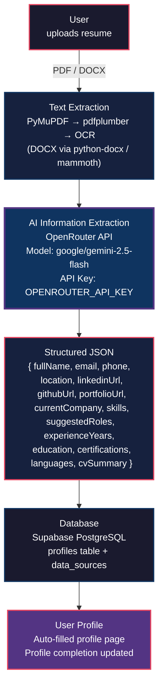

# CV Upload & AI Analysis Flow

This document describes the complete resume processing pipeline used in JobAI Scout.

## Architecture Diagram



## Step-by-Step Pipeline

### Step 1: User Uploads Resume

The user navigates to `/dashboard/cv` and uploads a resume file. Supported formats are:

| Format | Max Size | Content Strategy |
|--------|----------|-----------------|
| PDF | 20 MB | Text extracted via PyMuPDF → pdfplumber → OCR fallback |
| DOCX / DOC | 20 MB | Parsed via python-docx (service) or mammoth (edge fallback) |

**Key file:** `src/pages/CVUpload.tsx` — handles file selection, drag-and-drop, and upload flow.

### Step 2: Text Extraction

The uploaded file is stored in Supabase Storage under `resumes/{userId}/{timestamp}_{filename}`.

The `analyze-cv` edge function downloads the file and runs text extraction:

| Priority | Engine | When used |
|----------|--------|-----------|
| 1 | **Python service** (`services/cv-extractor/`) | When `CV_EXTRACTOR_URL` is configured |
| 2 | **Deno fallback** (`supabase/functions/_shared/cv-extraction.ts`) | When Python service is unavailable |

**PDF extraction chain (Python service):**

1. **PyMuPDF** — primary text extraction
2. **pdfplumber** — fallback for table-heavy or poorly extracted PDFs
3. **OCR (Tesseract via pytesseract)** — fallback when average text per page &lt; 50 chars (scanned PDFs)

**DOCX extraction:**

- Python service: `python-docx` (paragraphs + tables)
- Deno fallback: `mammoth`

**Deno fallback OCR:** Gemini 2.5 Flash vision when local PDF text is too sparse.

**Key files:**

- `services/cv-extractor/extractor.py` — PyMuPDF / pdfplumber / OCR logic
- `services/cv-extractor/main.py` — FastAPI `/extract` endpoint
- `supabase/functions/_shared/cv-extraction.ts` — shared extraction + fallbacks
- `supabase/functions/analyze-cv/index.ts` — orchestrates extraction → LLM

### Step 3: AI Information Extraction

The extracted plain text is sent to **OpenRouter API** using the `OPENROUTER_API_KEY` environment variable.

| Parameter | Value |
|-----------|-------|
| **API Provider** | OpenRouter (openrouter.ai/api/v1/chat/completions) |
| **Model** | `google/gemini-2.5-flash` |
| **API Key Env Var** | `OPENROUTER_API_KEY` |
| **Response Format** | `json_object` |
| **Temperature** | 0.1 (deterministic extraction) |
| **Max Tokens** | 3000 |

The system prompt instructs the AI to extract ALL data from the CV exactly as written, without inventing or assuming anything.

### Step 4: Structured JSON Output

The AI returns a JSON object with the following schema:

```json
{
  "fullName": "string",
  "email": "string (empty if not found)",
  "phone": "string (empty if not found)",
  "location": "string (empty if not found)",
  "linkedinUrl": "string (empty if not found)",
  "githubUrl": "string (empty if not found)",
  "portfolioUrl": "string (empty if not found)",
  "currentCompany": "string (empty if not found)",
  "skills": ["string"],
  "suggestedRoles": ["string"],
  "experienceYears": number,
  "education": "string (empty if not found)",
  "certifications": ["string"],
  "languages": ["string"],
  "cvSummary": "string",
  "_extraction": {
    "method": "pymupdf | pdfplumber | ocr | python-docx | unpdf | mammoth | gemini-ocr",
    "pages": 1,
    "ocrUsed": false,
    "charCount": 1234
  }
}
```

### Step 5: Database Storage

The extracted data is saved to the Supabase PostgreSQL `profiles` table, mapped to the following columns:

| Extracted Field | Profile Column |
|-----------------|---------------|
| fullName | `full_name` |
| email | `email` |
| phone | `phone` |
| location | `location` |
| linkedinUrl | `linkedin_url` |
| githubUrl | `github_url` |
| portfolioUrl | `portfolio_url` |
| currentCompany | `current_company` |
| skills | `skills` (text[]) |
| suggestedRoles | `desired_roles` (text[]) |
| experienceYears | `experience_years` (numeric) |
| education | `education` |
| certifications | `certifications` (text[]) |
| languages | `languages` (text[]) |
| cvSummary | `cv_summary` |

Each filled field is tagged with `data_source = 'ai'` via the `update_profile_data_sources` RPC function for auditability.

### Step 6: User Profile (Auto-Filled)

The frontend automatically refreshes the profile and displays:

1. **Profile completion bar** — percentage of fields now filled
2. **Extraction metadata** — method used (PyMuPDF, OCR, etc.), page count, character count
3. **Auto-filled fields** — marked with "Auto-filled" badge showing extracted values
4. **Preserved fields** — existing profile data is never overwritten
5. **Missing fields** — prompts the user to complete remaining gaps via Settings

## Running the Python Extractor (Local Dev)

```bash
cd services/cv-extractor
python -m venv .venv
.venv\Scripts\activate        # Windows
pip install -r requirements.txt
python main.py                # http://localhost:8001
```

**OCR requires Tesseract** installed on your system:

- Windows: `choco install tesseract` or download from GitHub
- macOS: `brew install tesseract`
- Linux: `sudo apt install tesseract-ocr`

Add to `.env`:

```env
CV_EXTRACTOR_URL=http://localhost:8001
```

Then sync to Supabase secrets:

```bash
node sync-env-to-supabase.js
```

## API Key Configuration

### Local Development (.env)

```env
VITE_GEMINI_API_KEY="your-gemini-api-key"
GEMINI_API_KEY="your-gemini-api-key"
VITE_OPENROUTER_API_KEY="sk-or-v1-your-openrouter-key"
OPENROUTER_API_KEY="sk-or-v1-your-openrouter-key"
CV_EXTRACTOR_URL="http://localhost:8001"
```

### Supabase Edge Function Secrets

Run the sync script to push keys to Supabase:

```bash
node sync-env-to-supabase.js
```

This sets `GEMINI_API_KEY`, `OPENROUTER_API_KEY`, and `CV_EXTRACTOR_URL` as secrets in your Supabase project.
