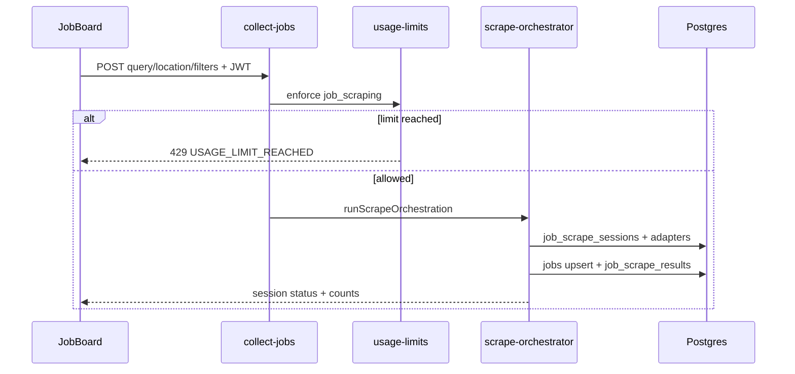
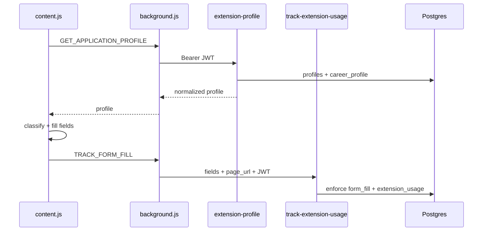

# Project Atlas — JobAI Scout System Map

> **Plan name:** Project Atlas  
> **Purpose:** Deep, code-accurate documentation of the JobAI Scout monorepo — product scope, architecture, data model, integrations, and operational notes.  
> **Last mapped from codebase:** July 2026

---

## Executive summary

**JobAI Scout** is a full-stack career platform for job seekers, recruiters, and administrators. Job seekers upload CVs, maintain a structured **Career Passport** profile, discover jobs via multi-source scraping with personalized match scoring, automate recurring searches, generate cover letters, use a **voice career assistant** grounded in a knowledge base, and fill external application forms through a **Chrome extension**. Recruiters post jobs on-platform and manage applicants through a hiring pipeline. Administrators approve new accounts, manage users and job sources, view analytics, configure voice/knowledge-base settings, and set **per-feature usage limits**.

New signups (job seekers and recruiters) enter a **pending approval** gate until an admin approves them. Admins bypass approval. The public marketing site (home, about, contact, privacy) is available without login.

The repository is a **Vite + React + TypeScript** SPA backed by **Supabase** (Postgres, Auth, Storage, Edge Functions) plus a **Manifest V3 Chrome extension** and optional local **Python CV extractor** service.

---

## Tech stack

| Layer | Technology |
|-------|------------|
| Frontend | React 18, TypeScript, Vite 5, React Router 6, TanStack Query |
| UI | shadcn/ui (Radix), Tailwind CSS, Framer Motion, Three.js (landing 3D) |
| i18n | i18next, react-i18next — 6 locales (en, fr, de, hi, ur, ar) with RTL |
| State | React Context (auth), Zustand (voice), React Hook Form + Zod |
| Backend | Supabase Postgres + RLS, Supabase Auth, Supabase Storage |
| Serverless | Supabase Edge Functions (Deno) |
| AI / external | Google Gemini (CV extraction, voice), OpenRouter (embeddings), Apify (LinkedIn/Indeed), Firecrawl (company careers), ElevenLabs (conversational agent + TTS) |
| Extension | Chrome MV3 — vanilla JS modules (`extension/`) |
| Testing | Vitest + jsdom + Testing Library; Playwright in scripts; extension `.test.mjs` files |
| Deploy | Vercel (frontend SPA rewrites), Supabase (DB + functions) |

**Dev server:** port `5181`, optional local HTTPS via `.certs/jobai-local.pfx` (`npm run setup:https`) for microphone access over LAN.

---

## Repository structure

```
JobAi_Scout/
├── src/                    # Main React SPA
│   ├── pages/              # Route-level screens (job seeker, recruiter, admin, public)
│   ├── components/         # UI, voice, automation, match, profile, chat, 3D
│   ├── contexts/           # AuthContext
│   ├── hooks/              # useMatchPreferencesGate, use-toast, useChat, etc.
│   ├── lib/                # job-scrape, match-preferences, usage-limits-client, career-profile
│   ├── locales/            # en, fr, de, hi, ur, ar JSON translation files
│   ├── integrations/supabase/  # client.ts, generated types.ts
│   ├── i18n/               # LocaleProvider, language definitions
│   ├── theme/              # ThemeProvider (light/dark)
│   └── test/               # Vitest unit/integration tests
├── extension/              # Production Chrome extension ("Job Form Fill" v4.3.0)
├── autofill-extension/     # Separate TypeScript extension scaffold (not wired in npm scripts)
├── supabase/
│   ├── migrations/         # 60+ SQL migrations (schema evolution)
│   ├── functions/          # Edge Functions + _shared modules
│   └── config.toml         # Auth + function JWT verify flags
├── scripts/                # i18n audits, RTL screenshots, extension config sync, verification
├── services/cv-extractor/  # Optional local Python PDF/DOCX text extraction
├── docs/                   # This document
├── sync-env-to-supabase.js # Pushes .env secrets to Supabase on dev start
├── package.json
├── vite.config.ts
└── vercel.json             # SPA deploy config
```

**Note:** `Project_plan/` contains stakeholder documents (PDFs/DOCX) — not runtime code. `README.md` is a user-facing product guide; this doc is the engineering deep map.

---

## Frontend application

### Routing (`src/App.tsx`)

All authenticated routes use `ProtectedRoute` with optional `requiredRole`. Pages are lazy-loaded.

#### Public routes

| Path | Page | Notes |
|------|------|-------|
| `/` | Index | Landing / marketing |
| `/login`, `/register` | Login, Register | Email/password signup; recruiter via `?role=recruiter` |
| `/forgot-password`, `/reset-password` | Password recovery |
| `/waiting-approval` | WaitingApproval | Shown when `approval_status !== 'approved'` |
| `/about`, `/contact`, `/privacy` | Static/marketing | Contact form is client-only success (no email backend) |

#### Job seeker routes (`requiredRole="user"`)

| Path | Page | Purpose |
|------|------|---------|
| `/dashboard` | Dashboard | Greeting, profile shortcuts, illustrative stats |
| `/dashboard/cv` | CVUpload | CV upload, extraction review, ATS suggestions |
| `/dashboard/jobs` | JobBoard | Search, live scrape, matched results, cover letter |
| `/dashboard/automation` | Automation | Scheduled job scrape schedules |
| `/dashboard/saved` | SavedJobs | Bookmarked jobs |
| `/dashboard/applications` | Applications | In-platform applications (not in sidebar nav) |
| `/dashboard/auto-fill` | AutoFormFill | Extension install/help |
| `/dashboard/assistant` | VoiceAssistant | VoiceMode — primary voice UI |
| `/dashboard/voice-agent` | VoiceAgent | ElevenLabs conversational agent (not in sidebar) |
| `/dashboard/settings` | ProfileSettings | Career Passport, contact, autofill prefs, locale/theme |

#### Recruiter routes (`requiredRole="recruiter"`)

| Path | Page |
|------|------|
| `/recruiter/profile` | RecruiterProfile |
| `/recruiter/jobs` | RecruiterJobs (create/edit/delete posts) |
| `/recruiter/candidates` | RecruiterCandidates (pipeline + notes) |
| `/recruiter/application-status` | RecruiterApplicationStatus (read-only counts) |

#### Admin routes (`requiredRole="admin"`)

| Path | Page |
|------|------|
| `/admin` | AdminDashboard |
| `/admin/users` | AdminUsers (approval, roles, delete) |
| `/admin/jobs` | AdminJobs (sources + catalog) |
| `/admin/analytics` | AdminAnalytics |
| `/admin/usage-limits` | AdminUsageLimits |
| `/admin/voice` | AdminVoice (direct URL; not in admin sidebar) |

### Key layout & components

- **`DashboardLayout`** — Sidebar navigation varies by role; RTL sidebar flips to right for `ur`/`ar`; includes `NavAppearanceControls` (language + theme).
- **`ProtectedRoute`** — Redirects unauthenticated → login; non-approved → waiting screen; wrong role → role home.
- **`useMatchPreferencesGate`** — Blocking first-run overlay on Automation, JobBoard, ProfileSettings until match weights/threshold saved.
- **`CareerProfileWorkspace`** — Structured career history editor (experience, education, projects, achievements, references).
- **`MatchPreferencesForm`** — Category weight sliders + minimum match threshold (must sum to 100%, skills mandatory >20%).
- **`VoiceMode`** / **`VoiceWidget`** — Speech recognition, TTS, KB-grounded chat via `voice-chat` edge function.
- **`CookieConsentBanner`** — Optional cookie consent before tracking.

### Providers (app shell)

`QueryClientProvider` → `AuthProvider` → `ThemeProvider` → `LocaleProvider` → routes.

---

## Authentication & roles

### Auth flow

1. **Register** (`Register.tsx`) — Supabase `signUp` with metadata `{ full_name, role, company_name? }`. Job seeker or recruiter.
2. **Profile + role rows** — Created via DB triggers on signup (see migrations).
3. **Approval gate** — New profiles default to `approval_status = 'pending'`. `ProtectedRoute` sends non-admins to `/waiting-approval` until approved.
4. **Session** — Supabase JS client with `localStorage` persistence (`src/integrations/supabase/client.ts`).
5. **AuthContext** — Loads `profiles`, `user_roles`, and `recruiter_profiles` (if recruiter) on auth state change.

### Roles (`user_roles.role`)

| Role | DB enum | Portal |
|------|---------|--------|
| Job seeker | `user` | `/dashboard/*` |
| Recruiter | `recruiter` | `/recruiter/*` |
| Administrator | `admin` | `/admin/*` |

Admins always resolve `approvalStatus` to `"approved"`. Role promotion/demotion via `manage-role` edge function and Admin Users UI.

### Approval lifecycle

- States: `pending`, `approved`, `rejected`, `expired`
- RPCs: `admin_set_account_approval`, `renew_approval_request`, `clear_approval_notice`, `expire_pending_approvals` (cron)
- Trigger `protect_approval_columns` — only admins (or service role) can mutate approval fields
- Existing users backfilled to `approved` on migration

### Preferences persisted on profile

- `preferred_locale` — synced with i18n (`LocaleProvider`)
- `preferred_theme` — light/dark via `ThemeProvider`

---

## Supabase backend

**Project ID (from config):** `uhvjleclbpseveyeajap`

### Schema highlights — core tables

| Table | Purpose |
|-------|---------|
| `profiles` | User profile, CV fields, career_profile JSONB, autofill_preferences, match_weights, approval fields, locale/theme |
| `user_roles` | Maps auth.users → admin / user / recruiter |
| `recruiter_profiles` | Company name, website, industry, description |
| `jobs` | Unified job catalog (recruiter-posted + scraped external) |
| `job_sources` | Admin-configured RSS / company_career / linkedin_apify sources |
| `job_scrape_sessions` | Sequential multi-adapter scrape run state |
| `job_scrape_results` | Per-user scored job results linked to sessions |
| `job_scrape_schedules` | User automation schedules (once, daily, days_of_week, monthly) |
| `saved_jobs` | User bookmarks |
| `job_applications` | In-platform applications with cover letter |
| `application_questions` / `application_answers` | Recruiter custom application forms |
| `applied_jobs` | Extension-tracked external applications |
| `extension_usage` | Form-fill telemetry |
| `feature_usage_limits` / `feature_usage_log` | Usage metering (new) |
| `voice_conversations` / `voice_messages` | Voice assistant history |
| `voice_settings` | Global admin + per-user voice config |
| `voice_analytics` / `voice_search_logs` | Voice usage metrics |
| `kb_sources` / `kb_chunks` | Knowledge base documents + vector chunks |
| `resume_ats_analyses` | ATS score and improvement suggestions |
| `recommended_jobs` | Curated recommendations |
| `candidate_notes` | Recruiter private notes on applicants |
| `admin_audit_log` | Admin action audit trail |
| `messages` | Messaging (job-linked) |
| `scan_history` | CV scan history |

### Important RPCs / functions

| RPC | Purpose |
|-----|---------|
| `has_role(user_id, role)` | RLS helper |
| `search_scrape_session_jobs(...)` | Filter/paginate scrape results by match score + terms |
| `enforce_and_record_feature_usage` | Atomic usage limit check + log |
| `claim_due_job_scrape_schedules` | Cron claims due automation rows |
| `get_platform_analytics` | Admin analytics aggregates |
| `match_kb_chunks` | Vector similarity search for voice KB |
| `admin_set_account_approval` | Approve/reject accounts |
| `update_profile_data_sources` | Track field provenance (ai/user/extension/system) |

### Migration themes (chronological clusters)

1. **Foundation** (`20260308*`) — profiles, jobs, saved_jobs, job_applications, user_roles, RLS
2. **Recruiter panel** (`20260404*`) — recruiter_profiles, recruiter_id on jobs, recruiter role
3. **Job discovery** (`20260621*`, `20260716*`) — job_sources, collection metadata, dedup indexes, search RPCs
4. **Voice & KB** (`20260622*`, `20260708*`, `20260709*`) — voice tables, kb_chunks metadata, hybrid search
5. **Career Passport** (`20260719*`) — career_profile JSONB, autofill_preferences, Google Forms commute prefs, private profile images
6. **Job matching & scraping** (`20260721*`) — match controls, sequential sessions, discovery controls, schedules + pg_cron dispatch
7. **Resume quality** (`20260720*`, `20260723*`) — ATS analyses, CV replacement queue
8. **Recruiter pipeline** (`20260717*`) — application statuses, candidate profile access
9. **Account governance** (`20260727*`) — approval workflow, admin delete audit, signup method protection, preferred locale/theme
10. **Usage limits & match prefs** (`20260728*`) — feature_usage_*, enforce RPC, match_weights on profiles

### Edge Functions — inventory & purpose

| Function | JWT verify | Purpose |
|----------|------------|---------|
| `analyze-cv` | yes | Upload CV → Gemini extraction → profile merge → ATS analysis |
| `collect-jobs` | no* | Authenticated manual scrape; usage-guarded orchestration |
| `run-scheduled-scrapes` | no | Cron dispatcher (`x-cron-secret`); automation usage limits |
| `scrape-jobs` | no | Legacy Apify/SerpAPI scrape endpoint |
| `sync-jobs` | no | Job catalog sync helper |
| `generate-cover-letter` | no | Tailored cover letter for a job + profile |
| `send-application` | no | Submit in-platform job application |
| `extension-profile` | yes | Normalized autofill profile for Chrome extension |
| `track-extension-usage` | no | Form-fill metering + extension_usage log |
| `track-applied-job` | no | Record external application |
| `voice-chat` | no | KB-grounded career assistant (Gemini + embeddings) |
| `voice-transcribe` | no | Speech-to-text |
| `voice-tts` | yes | Text-to-speech |
| `voice-settings` | no | Read/write voice configuration |
| `voice-agent-llm` | no | LLM backend for ElevenLabs agent |
| `voice-agent-guard` | no | Agent session guardrails |
| `elevenlabs-tts` | no | ElevenLabs TTS |
| `elevenlabs-conversation-token` | no | Token for ElevenLabs Conversational AI |
| `career-chat` | no | Text career chat (alternate path) |
| `kb-ingest-document` / `kb-ingest-pdf` / `kb-reindex` | no | Knowledge base ingestion |
| `manage-role` | no | Admin promote/demote roles |
| `manage-usage-limits` | no | Admin CRUD for usage limits |
| `delete-user` | no | Admin permanent user deletion |
| `expire-pending-approvals` | no | Cron: expire stale pending accounts |
| `security-alert` | no | Security notifications |
| `api` | no | General API router |

\*`collect-jobs` validates JWT manually in handler despite `verify_jwt = false` in config.

### Shared modules (`supabase/functions/_shared/`)

| Module | Role |
|--------|------|
| `scrape-orchestrator.ts` | Sequential LinkedIn → Indeed → RSS → Company Careers pipeline |
| `job-scrape-plan.ts` | Adapter ordering, timeouts, progress |
| `job-match-scoring.ts` | Weighted match score + breakdown |
| `match-preferences.ts` | Shared weight/threshold validation (imported by frontend too) |
| `usage-limits.ts` / `scrape-usage-guard.ts` | Limit resolution + enforcement |
| `cv-profile-merge.ts` | Merge extracted CV into profile + career_profile |
| `cv-extraction.ts` | Text extraction from uploads |
| `ats-resume-analysis.ts` | ATS scoring persistence |
| `job-collection.ts` | Normalize/dedupe/upsert collected jobs |
| `adapters/*` | linkedin-apify, indeed-apify, rss, company-career |
| `openrouter-embeddings.ts`, `gemini.ts` | AI providers |
| `taxonomy/*` | Skills/job/location normalization JSON + helpers |

---

## Chrome extension (`extension/`)

**Name:** Job Form Fill v4.3.0  
**Purpose:** Evidence-led application form filling on major ATS sites and Google Forms.

### Key files

| File | Role |
|------|------|
| `manifest.json` | MV3 permissions, host patterns (Greenhouse, Lever, Workday, Ashby, LinkedIn, Indeed, Google Forms, Supabase) |
| `api.js` | Supabase auth (email + Google via chrome.identity), token refresh, profile/resume download, form-fill tracking |
| `background.js` | Service worker — profile boundary; content scripts request data via messages |
| `content.js` | Field classification (semantic NLP patterns), Shadow DOM walking, human-like typing, file upload |
| `decision-engine.js` | Safety/confidence gating for sensitive answers |
| `profile-service.js` | Calls `extension-profile` edge function |
| `popup.js` / `popup.html` | Sign-in UI, fill controls |
| `storage.js` | Session persistence |
| `config.local.json` | Generated by `npm run extension:config` from `.env` |

### Backend communication

1. **Auth** — Direct Supabase Auth REST (`/auth/v1/token`, refresh, Google OAuth redirect).
2. **Profile load** — `POST /functions/v1/extension-profile` with Bearer JWT (read-only; no quota).
3. **Form fill tracking** — `POST /functions/v1/track-extension-usage` enforces `form_fill` usage limit and logs fields filled.
4. **Resume download** — Storage signed URL flow via `api.downloadResume`.

Content scripts **never** hold raw credentials; they message the background worker for profile data.

### Tests

`npm run extension:test` runs: `decision-engine.test.mjs`, `content.smoke.test.mjs`, `google-forms.test.mjs`, `resume-upload.test.mjs`, `form-fill-metering.test.mjs`.

### Alternate: `autofill-extension/`

TypeScript/Vite-based extension with framework handlers (Radix, MUI, Ant Design, Google Forms). **Not referenced in main `package.json` scripts** — treat as experimental/legacy scaffold; production path is `extension/`.

---

## Core features (in depth)

### 1. Job scraping & Browse Jobs

**User flow:** JobBoard → enter keywords/location/filters → invoke `collect-jobs` → watch sequential adapter progress → browse scored results.

**Pipeline (`scrape-orchestrator.ts`):**

1. Create/resume `job_scrape_sessions` row (conflict if already running).
2. Run adapters **sequentially**: LinkedIn (Apify) → Indeed (Apify) → RSS feeds → Company careers (Firecrawl).
3. Normalize, deduplicate, upsert into `jobs`.
4. Score each job against user profile using `job-match-scoring.ts` + user's `match_weights`.
5. Store results in `job_scrape_results`; filter by `min_match_threshold` (default 40).
6. UI queries via `search_scrape_session_jobs` RPC.

**Sources:** Admin manages `job_sources` (Admin Jobs). Requires env secrets: `APIFY_API_TOKEN`, actor IDs, `FIRECRAWL_API_TOKEN`, optional LinkedIn cookies.

**Usage limit:** `job_scraping` feature — checked before any scrape work starts.

### 2. Automation (scheduled scrapes)

**UI:** `Automation.tsx` + `ScheduleFormDialog`, `ScheduleCard`, `RecurrenceFields`.

**Data:** `job_scrape_schedules` with recurrence types: `once`, `daily`, `days_of_week`, `monthly_repeat`, `monthly_once`.

**Dispatch:** pg_cron (see migration `20260721000400`) calls `run-scheduled-scrapes` every minute with `CRON_DISPATCH_SECRET`. Claims due schedules atomically, runs same orchestration as manual scrape.

**Usage limit:** `automation` feature (separate from manual `job_scraping`).

### 3. Form Fill (browser extension)

**In-app:** `AutoFormFill.tsx` explains installation and supported sites.

**Engine:** Semantic field patterns map DOM labels to profile keys including structured Career Passport sections (multi-job experience, education blocks, references). `decision-engine.js` applies confidence thresholds from `autofill_preferences` (textAutofillConfidence, checkboxConfidence, reviewBeforeSensitiveAnswers).

**Safety:** Unknown screening questions left blank rather than guessed; sensitive answers may require review.

### 4. Voice Assistant

**Primary UI:** `/dashboard/assistant` → `VoiceMode` (no text-chat fallback in UI).

**Backend:** `voice-chat` edge function:
- Loads global/per-user `voice_settings` (personality: professional, friendly, recruiter, support)
- Rewrites query using conversation history
- Embeds query via OpenRouter → `match_kb_chunks` hybrid retrieval
- Generates response via Gemini with injection sanitization
- Enforces `voice_assistant` usage limit
- Persists to `voice_conversations` / `voice_messages`

**Alternate:** `/dashboard/voice-agent` uses `@elevenlabs/react` ConversationProvider + `VITE_ELEVENLABS_AGENT_ID` — real-time conversational agent (not in nav).

**Admin:** `/admin/voice` for KB/voice configuration.

### 5. Career Passport / profile

**Storage model:**
- Scalar fields on `profiles` (name, contact, skills, desired_roles, etc.)
- `career_profile` JSONB: `{ version, experiences[], education[], projects[], achievements[], references[] }`
- `autofill_preferences` JSONB for extension behavior
- `application_answers` JSONB for saved screening answers
- `data_sources` JSONB tracks provenance per field

**CV upload (`analyze-cv`):**
- Optional local `services/cv-extractor` or edge extraction
- Gemini structured JSON extraction with taxonomy normalization
- Merge into profile via `cv-profile-merge.ts` with replacement queue for conflicting fields
- ATS analysis stored in `resume_ats_analyses`

**UI:** `CVUpload.tsx`, `ProfileSettings.tsx`, `CareerProfileWorkspace.tsx`, field defs in `career-passport-fields.ts`.

### 6. Job Matching Setup (weights & threshold)

**First-run gate:** Users must complete `MatchPreferencesForm` before Automation, Job Board, or Settings (via `useMatchPreferencesGate`).

**Categories:** skills (mandatory, min weight >20%), location, desiredRole, experience, education, salary — must sum to 100%.

**Storage:** `profiles.match_weights`, `min_match_threshold`, `has_set_match_preferences`.

**Scoring:** Shared module `match-preferences.ts` imported by both frontend and edge functions ensures UI and scrape scorer stay aligned. `resolveEffectiveWeights` falls back to equal weighting if user hasn't set preferences.

### 7. Usage Limits (admin)

**Features metered:** `job_scraping`, `form_fill`, `voice_assistant`, `automation`.

**Resolution order:** per-user override → global default → unlimited (warned in logs).

**Default global seeds (migration):** 20/day scraping, 50/day form fill, 100/day voice, 10/day automation.

**Admin UI:** `/admin/usage-limits` — edit global defaults, per-user overrides, view usage counts, audit log.

**Enforcement:** `enforce_and_record_feature_usage` RPC (advisory lock per user+feature) + edge function wrappers. Client shows localized toast via `usage-limits-client.ts`.

### 8. i18n & RTL

**Locales:** en, fr, de, hi (LTR); ur, ar (RTL).

**Mechanisms:**
- `src/i18n/index.ts` loads JSON resources
- `LocaleProvider` syncs with `profiles.preferred_locale`
- `isRtlLocale` drives `dir=rtl`, sidebar side, `MixedDir` for mixed-direction text
- `NavAppearanceControls` + `LanguageSwitcher`

**Tooling:** `npm run i18n:check`, `i18n:parity`, `i18n:audit`, `lint:i18n`, Playwright screenshot scripts for RTL/coverage verification in `scripts/`.

**README note:** README lists 4 languages; codebase supports 6 (ur, ar added).

### 9. Recruiter & admin (summary)

**Recruiters:** CRUD jobs with application questions; view applicants; update status (new → shortlisted → rejected → hired); private notes; read-only status dashboard.

**Admins:** User approval/rejection/expiry; role changes; user deletion with audit; job source management; platform analytics; usage limits; voice/KB admin (direct URL).

---

## Data flow diagrams

### Job scrape (manual)



### Extension form fill



---

## Testing approach

### Unit / integration (Vitest)

Located in `src/test/` and co-located `*.test.ts(x)`:

| Test file | Coverage area |
|-----------|---------------|
| `job-match-scoring.test.ts` | Match score algorithm |
| `match-preferences.test.ts` | Weight validation, threshold |
| `match-preferences-form.test.tsx` | Form UI behavior |
| `job-scrape-ui.test.ts` | Scrape UI helpers |
| `job-scrape-plan.test.ts` | Adapter plan |
| `scrape-usage-guard.test.ts` | Usage guard wrapper |
| `usage-limits.test.ts` | Limit resolution math |
| `usage-limits-client.test.ts` | Client toast/error parsing |
| `cv-profile-sync.test.ts` | CV → profile merge |

Run: `npm test` / `npm run test:watch`

### Extension tests

Run: `npm run extension:test` (Node `.test.mjs` files, no Vitest).

### Script-based verification

`scripts/` contains Playwright-based visual/regression checks for i18n, RTL, mobile nav, career passport translations, autofill contrast — primarily CI/manual QA artifacts, not in default `npm test`.

---

## Environment & deployment

### Frontend env vars (Vite — `import.meta.env.VITE_*`)

| Variable | Purpose |
|----------|---------|
| `VITE_SUPABASE_URL` | Supabase project URL |
| `VITE_SUPABASE_PUBLISHABLE_KEY` | Anon/public key |
| `VITE_SUPABASE_PROJECT_ID` | Used by sync-env script |
| `VITE_ELEVENLABS_AGENT_ID` | Voice Agent page (optional) |
| `VITE_GEMINI_API_KEY` / `VITE_OPENROUTER_API_KEY` | May exist client-side; primary AI runs in edge functions |

Local `.env` is gitignored. `npm run dev` runs `sync-env-to-supabase.js` then `scripts/sync-extension-config.mjs`.

### Supabase secrets (pushed via sync-env)

Includes: `GEMINI_API_KEY`, `OPENROUTER_API_KEY`, `APIFY_API_TOKEN`, `FIRECRAWL_API_TOKEN`, LinkedIn cookie/actor configs, `CV_EXTRACTOR_URL`, `CRON_DISPATCH_SECRET`.

### Deploy

| Target | Method |
|--------|--------|
| Frontend | Vercel — `npm run build` → `dist/`, SPA rewrites in `vercel.json` |
| Database | `supabase db push` / apply migrations |
| Edge Functions | `supabase functions deploy <name>` |
| Extension | Load unpacked `extension/` in Chrome; run `npm run extension:config` after env changes |

**HTTPS locally:** Required for microphone on LAN IPs — `npm run setup:https` then `npm run dev:https`.

---

## Recent & in-progress capability areas

Based on current uncommitted/working-tree signals (July 2026):

1. **Feature usage limits** — Full stack: migrations, RPC, edge enforcement, admin UI, client toasts, extension metering tests.
2. **Match preferences** — Profile columns, shared validation module, first-run gate hook, JobBoard/Automation integration, updated `search_scrape_session_jobs` RPC.
3. **RTL locales (ur, ar)** — Locale files, screenshot verification scripts, logical CSS conversion tooling.
4. **Career Passport i18n** — Field label keys, verification scripts with proof screenshots.
5. **Account approval workflow** — Waiting screen, expiry cron, admin promote/demote.
6. **Preferred locale/theme persistence** — Profile-backed appearance sync.
7. **NavAppearanceControls** — Unified language/theme switcher component.

---

## Suggested operational next steps

Factual items visible from code/migrations (not prescriptions):

1. **Apply pending migrations** if not yet on remote DB:
   - `20260728000100_feature_usage_limits.sql`
   - `20260728000200_enforce_usage_limit_rpc.sql`
   - `20260728000300_match_preferences.sql`
   - Plus any earlier `20260727*` approval/locale/theme migrations.

2. **Deploy updated edge functions** directly touched by usage/match work:
   - `collect-jobs`, `run-scheduled-scrapes`, `voice-chat`, `track-extension-usage`, `manage-usage-limits`, `extension-profile`.

3. **Set Supabase secrets** required for scraping/voice/cron:
   - `CRON_DISPATCH_SECRET` (must match pg_cron migration header value)
   - Apify, Firecrawl, Gemini, OpenRouter tokens via `sync-env-to-supabase.js` or CLI.

4. **Regenerate types** after migrations: update `src/integrations/supabase/types.ts` if schema drifted.

5. **Extension config sync:** Run `npm run extension:config` and reload extension after env changes.

6. **Verify pg_cron job** `dispatch-job-scrape-schedules` exists (from `20260721000400`) for automation to fire.

7. **i18n parity:** Run `npm run i18n:parity` / `i18n:check` before release — README still mentions 4 languages while app ships 6.

---

## Architecture principles observed

- **Shared business logic in `_shared/`** — Match preferences and usage limits imported by frontend (via relative path) and edge functions to avoid drift.
- **Usage limits short-circuit before expensive work** — Scrape orchestration and voice chat check quotas first.
- **Sequential scrape adapters** — Predictable progress UI; sources within one adapter may parallelize.
- **RLS everywhere** — Admin capabilities via `has_role`; service role for edge writes.
- **Approval gate** — Product-level access control beyond auth.
- **Evidence-led autofill** — Extension prefers blank fields over guessed sensitive answers.

---

## Related files quick reference

| Concern | Primary paths |
|---------|---------------|
| Routes | `src/App.tsx` |
| Auth | `src/contexts/AuthContext.tsx`, `src/components/ProtectedRoute.tsx` |
| Job scrape UI | `src/pages/JobBoard.tsx`, `src/lib/job-scrape.ts` |
| Match prefs | `src/lib/match-preferences.ts`, `src/hooks/useMatchPreferencesGate.ts` |
| Usage limits UI | `src/pages/AdminUsageLimits.tsx`, `src/lib/usage-limits-client.ts` |
| Scrape backend | `supabase/functions/_shared/scrape-orchestrator.ts` |
| Extension | `extension/content.js`, `extension/api.js`, `extension/background.js` |
| Types | `src/integrations/supabase/types.ts` |
| i18n | `src/i18n/`, `src/locales/*.json` |
| User docs | `README.md` |

---

*Generated as part of **Project Atlas** — a read-only documentation deliverable. No application code was modified.*
